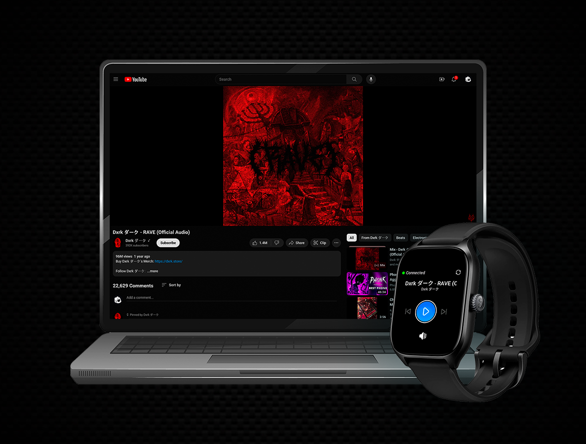

<br />
<p align="center">
  <a href="https://github.com/StarPandaBeg/RemoteMedia">
    
  </a>

  <h3 align="center">Remote Media - Windows Service</h3>

  <p align="center">
    Desktop service for Windows. Provides remote control of the playing media using MQTT commands.
  </p>
</p>

---

<div align="center">
  
</div>
<br/>

# Features

- Play/Pause current media
- Play next/previous track
- View information about current playing track
- Adjust device sound volume
- Fully encrypted & secure data transfer

> See [RemoteMediaClient](https://github.com/StarPandaBeg/RemoteMediaClient) for more info about this application purpose

# Getting started

To get a local copy up and running follow these simple steps.

> ⚠️ To use application you need to have configured RemoteMediaWebServer and install RemoteMediaClient on your ZeppOS device.

## Automatic installation

### Installation

This application may be installed by provided PowerShell script. To do so follow this steps:

1. Download latest [release](https://github.com/StarPandaBeg/RemoteMedia/releases/latest) from releases page
1. Unpack archive to desired application folder (for example `C:\Program Files\RemoteMediaService`) and run Setup.ps1 with administrator rights

   ```powershell
   .\Setup.ps1
   ```

1. Follow further instructions from script

During installation script will ask for some settings:

- _MQTT Host_ - Hostname of your mqtt broker;
- _MQTT Port_ - Port of your mqtt broker. Default: 1883;
- _MQTT User_ - Username to authorize in your mqtt broker
- _MQTT Password_ - Password to authorize in your mqtt broker
- _Listen Topic_ - Which topic this service should listen for commands. Default: `/remotemedia/control`
- _Response Topic_ - Which topic this service should send responses to. Default: `/remotemedia/out`
- _Ping Topic_ - Which topic this service should send ping messages to. Default: `/remotemedia/ping`

After installation the encryption key will be generated. **Do not share it with anyone.** It will be necessary for [RemoteMediaWebService](https://github.com/StarPandaBeg/RemoteMediaWebService) installation

### Uninstall app

To uninstall app, run Setup.ps1 with -u argument

```powershell
.\Setup.ps1 -u
```

## Manual build & installation

### Build

1. Clone the repo

   ```cmd
   git clone https://github.com/StarPandaBeg/RemoteMedia.git
   ```

1. Open project in the Visual Studio 2019 or later
1. Run NuGet to install all dependencies
   ```cmd
   nuget restore RemoteMedia.sln
   ```
1. Press `Ctrl+Shift+B` to build application. Ensure that Release build selected.

### Installation

1.  Copy Release folder content to desired application folder (for example `C:\Program Files\RemoteMediaService`) and open Command Line there
1.  Run sc.exe to create new service

    ```cmd
    sc.exe create RemoteMedia binpath= "C:\Program Files\RemoteMediaService\RemoteMedia.exe" start= auto displayname= "RemoteMedia Service"
    ```

1.  (Optional) Set service description

    ```cmd
    sc.exe description RemoteMedia "This service provides remote control of the playing media using MQTT commands."
    ```

1.  Configure service environment variables

    1. Create new PowerShell script with next content

       ```powershell
       $variableDictionary = @{
        "MQTT_HOST" = ""s
        "MQTT_PORT" = 1883
        "MQTT_USE_CREDENTIALS" = "false"
        "MQTT_USERNAME" = ""
        "MQTT_PASSWORD" = ""
        "MQTT_LISTEN_TOPIC" = "/remotemedia/control"
        "MQTT_RESPONSE_TOPIC" = "/remotemedia/out"
        "MQTT_PING_TOPIC" = "/remotemedia/ping"
        "ENCRYPTION_KEY" = ""
       }

       $registryPath = "HKLM:\SYSTEM\CurrentControlSet\Services\RemoteMedia"
       $multiSzValue = @()

       foreach ($key in $variableDictionary.Keys) {
           $multiSzValue += "$key=$($variableDictionary[$key])"
       }
       $multiSzValue = $multiSzValue -join '\0'

       New-ItemProperty -Path $registryPath -Name "Environment" -PropertyType MultiString -Value $multiSzValue
       ```

    1. Fill configuration values with corresponding data. All keys explained above in the [**Auto deploy** section](#auto-deploy).

    1. Fill `ENCRYPTION_KEY` with random string of 32 symbols length.

    1. Run script

1.  Or you may set configuration values in the `appSettings` section of the `RemoteMedia.exe.config` file

    > ⚠️ This variables will be overwritten by enviroment ones if present

    ```xml
    <appSettings ...>
        <add key="MQTT_HOST" value="" />
        <add key="MQTT_PORT" value="1883" />
        <add key="MQTT_LISTEN_TOPIC" value="/remotemedia/control" />
        <add key="MQTT_RESPONSE_TOPIC" value="/remotemedia/out" />
        <add key="MQTT_PING_TOPIC" value="/remotemedia/ping" />
        <add key="MQTT_USE_CREDENTIALS" value="false" />
        <add key="MQTT_USERNAME" value="" />
        <add key="MQTT_PASSWORD" value="" />
        <add key="ENCRYPTION_KEY" value="" />
    </appSettings>
    ```

1.  Run service

```cmd
sc.exe start RemoteMedia
```

### Uninstall app

To uninstall app, run this command

```cmd
sc.exe delete RemoteMedia
```

# Contributing

Contributions are what make the open source community such an amazing place to be learn, inspire, and create. Any contributions you make are **greatly appreciated**.

1. Fork the Project
2. Create your Feature Branch
   `git checkout -b feature/feature`
3. Commit your Changes
   `git commit -m 'Add some feature'`
4. Push to the Branch
   `git push origin feature/feature`
5. Open a Pull Request

# License

Distributed under the MIT License.  
See `LICENSE` for more information.

# Disclaimer

This project was created for learning purposes on how to develop services for Windows and network applications in general. It may contain errors or inaccuracies. I would appreciate your feedback and suggestions for improvement. Thanks! 💗
